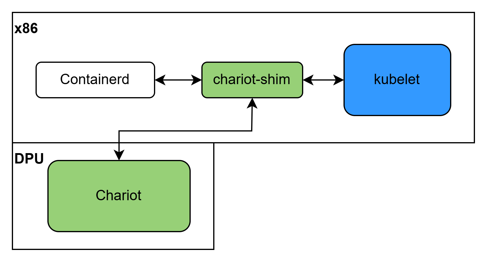

# Chariot

[](http://github.com/openbce/chariot)
[](http://github.com/openbce/chariot)
[](https://github.com/openbce/chariot/releases)
[](https://bestpractices.coreinfrastructure.org/projects/8377)

Chariot is a lightweight container runtime to support offload pod/container for HPC/AI.

## Description



### chariot

A lightweight container runtime in xPU.

### chariot-shim

A shim to communicate with Containerd/Docker on host and Chariot in xPU.

## Tutorial

### Download OCI images

```
$ export CHARIOT_HOME=/opt/chariot
$ skopeo copy docker://quay.io/quay/busybox:latest dir://${CHARIOT_HOME}/images/busybox/latest
```

## License

Copyright 2024.

Licensed under the Apache License, Version 2.0 (the "License");
you may not use this file except in compliance with the License.
You may obtain a copy of the License at

    http://www.apache.org/licenses/LICENSE-2.0

Unless required by applicable law or agreed to in writing, software
distributed under the License is distributed on an "AS IS" BASIS,
WITHOUT WARRANTIES OR CONDITIONS OF ANY KIND, either express or implied.
See the License for the specific language governing permissions and
limitations under the License.

